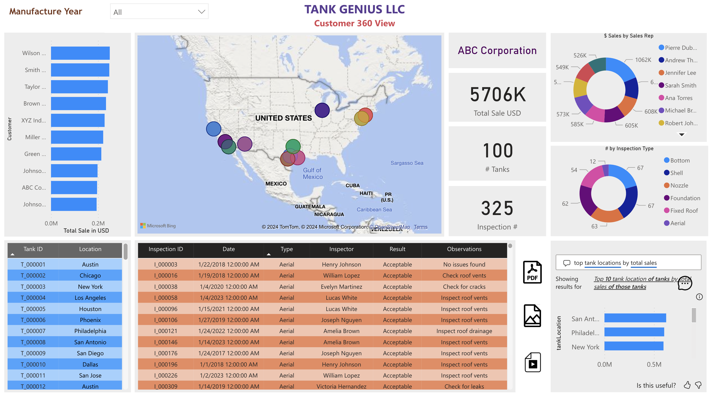
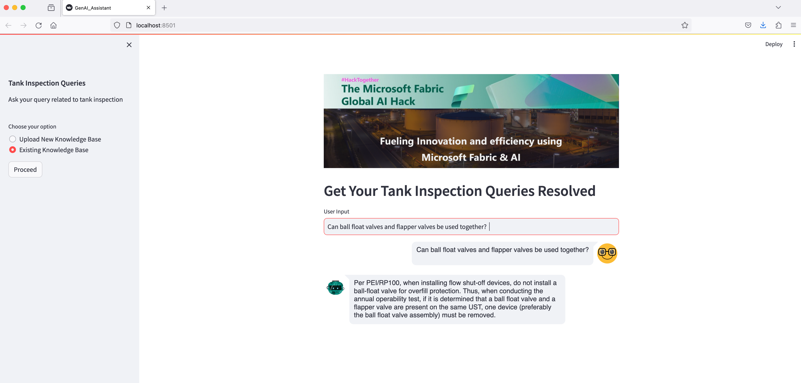

# Fueling Innovation and efficiency using Microsoft Fabric


## Introduction

This proof-of-concept has been developed for global tank manufacturing and inspection company. The solution aims to revolutionize the manufacturing, repair & maintenance(R&M) and inspection process by leveraging Microsoft Fabric.

The state-of-the-art cloud data platform is intricately designed to seamlessly ingest data, process and empower advanced analytics thereby driving operational excellence.

The data platform offers a comprehensive view across **ingestion, processing, and consumption** stages, while also addressing data governance aspects such as **Data Security, Data Quality, and Data Lineage etc.**

## OneLake Medallion Architecture

The high-level solution architecture of proposed solution is as shown below -


**Source System**  - connect to on-premise and cloud-based sources with more than 150+ built-in connectors

**Data Ingestion** - automate data ingestion and ETL processing using pipeline management

**Data Engineering, Data Science and Analytical workloads** - supports all types of workloads to adress advanced analytical use cases

**OneLake Data Hub** - manage all your data from OneLake for searchability, governance, and compliance

**Reporting and Insights** - create impactful reports and discover ley insight from data

Check this [demo](https://youtu.be/wU65mxBvzw4) to see data platform in action.

**Sample Screenshot**

 



## Solution Features

- **Data Preparation**: Sample Customer, Tank, Design and Inspection data available in `data` folder
- **Enterprise data Platform**: Microfot Fabric to build enterprise grade platform
- **Customer 360 Dashboard**: A real-time dashboard to get a customer 360 view to increase topline growth
- **Gen-AI Assistant**: Users can ask questions, and the Gen-AI assistant responds with relevant information extracted from the uploaded knowledge base.

## Git Repository Structure

- `app`: This folder provides main GenAI Assistant application containing the Streamlit UI and backend logic
- `notebooks`: This folder provides the PySpark notebook used to ingest and process data from ADLS Blob storage
- `app/knowledge_base`: This folder contains tank inspection related knowledge artefacts
- `data`: Sample data used for data ingestion and processing (Custeomr, Tank, Design and Inspection)
- `inspection_report`: Sample inspection reports generated by field engineer at site
- `README.md`: Documentation file providing information about the solution

## Gen-AI Assistant

### Prerequisites

Before running the project, make sure you have the following prerequisites:

- Python 3.7+ (Code has been tested on Python ver 3.9.6)
- LangChain
- Streamlit
- PyPDF2
- langchain
- An OpenAI API key
- Knowledge artifact to upload

### Steps to Run the codebase

1. Clone the repository to your local machine:

   ```bash
   git clone https://github.com/darshanpv/MS_Fabric_Cloud_Data_Platform.git
   cd MS_Fabric_Cloud_Data_Platform
   ```

2. Create your virtual environemt to this folder(if needed) and install the required dependencies by running:
   ```bash
   pip install -r app/requirements.txt
   ```

3. Add your OpenAI API key in `app/config/openai_key' file

4. Run the Streamlit app:
   ```bash
   cd app
   streamlit run tank_assistant.py
   ```

5. Access the Gen-AI Assistant app by opening a web browser and navigating to the provided URL.

6. You can provide Gen-AI Assistant either with existing knowledge base or Upload your knowledge tarifacts using radio button provided in the sidebar of the application.

7. Select the "Existing Knolwledge Base" option and click the "Proceed" button to process the documents and generate vector embeddings.

8. Interact with Gen-AI Assistant by typing your questions in the chat input box. (e.g. "Can ball float valves and flapper valves be used together?")


## Contributors

- Rudra Srivastava
- Piyush Kumar Singh
- Varun Sehgal
- Shivnsh Shukla

## Contact
If you have any questions, suggestions, or would like to discuss this solution further, feel free to get in touch with me.
